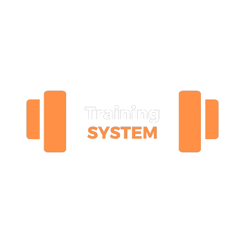
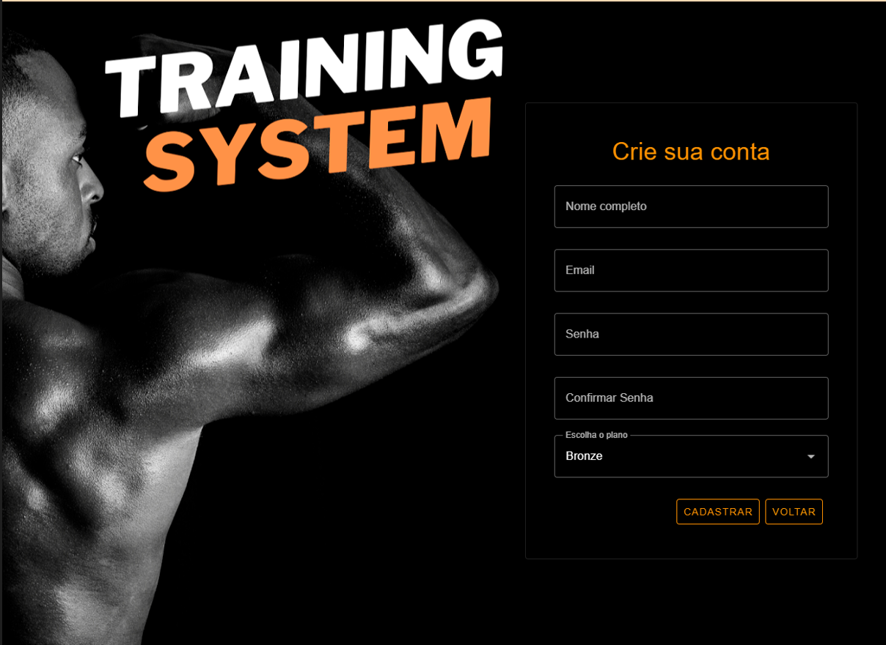
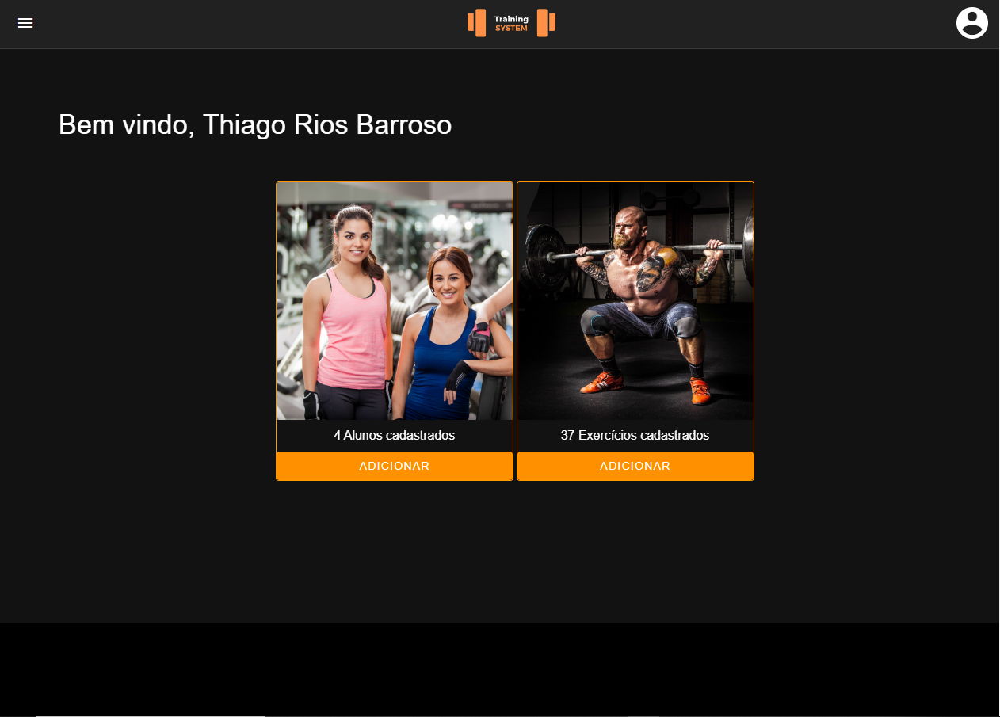
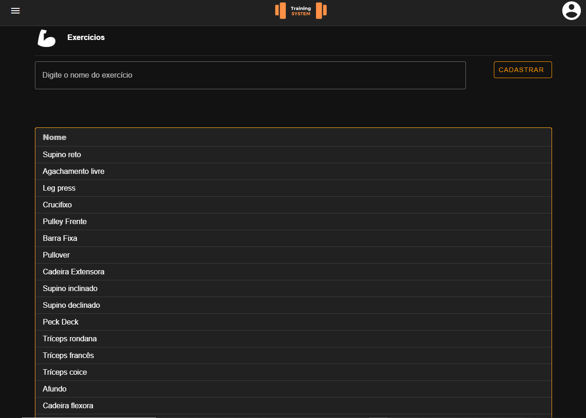
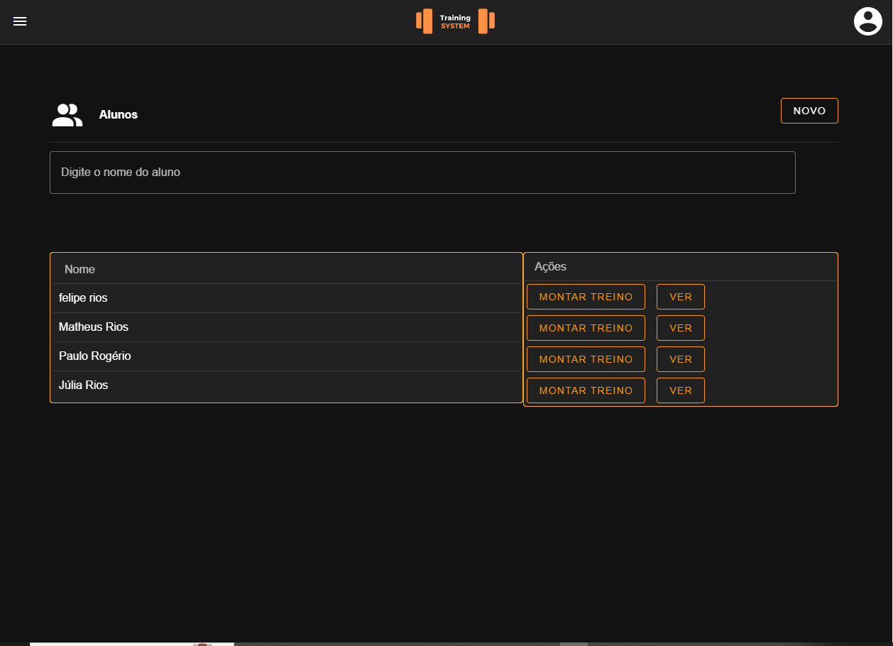
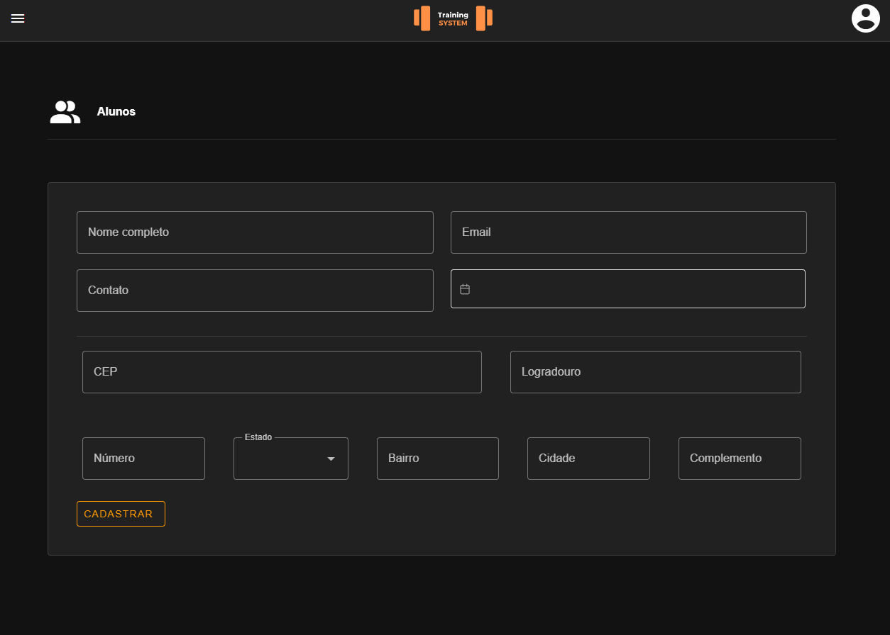
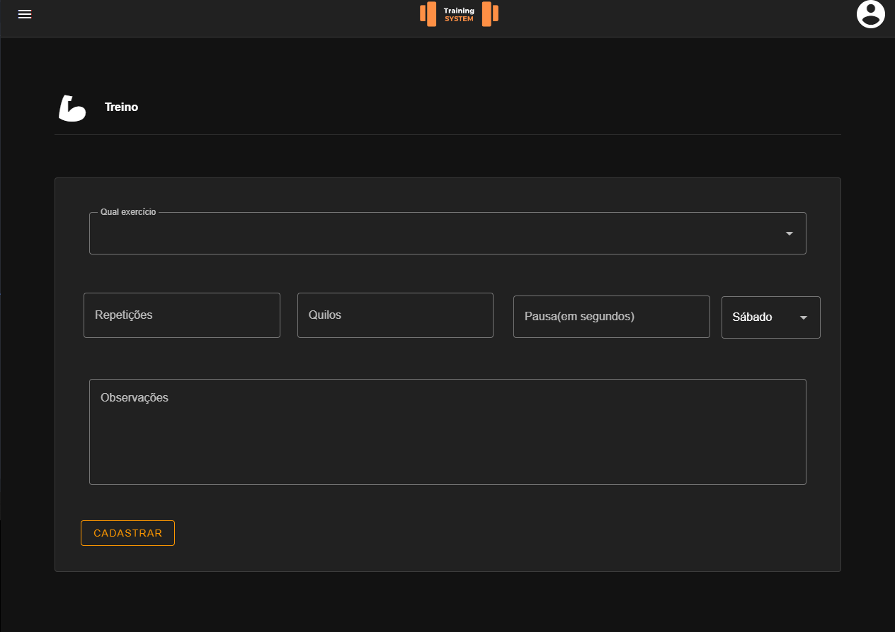
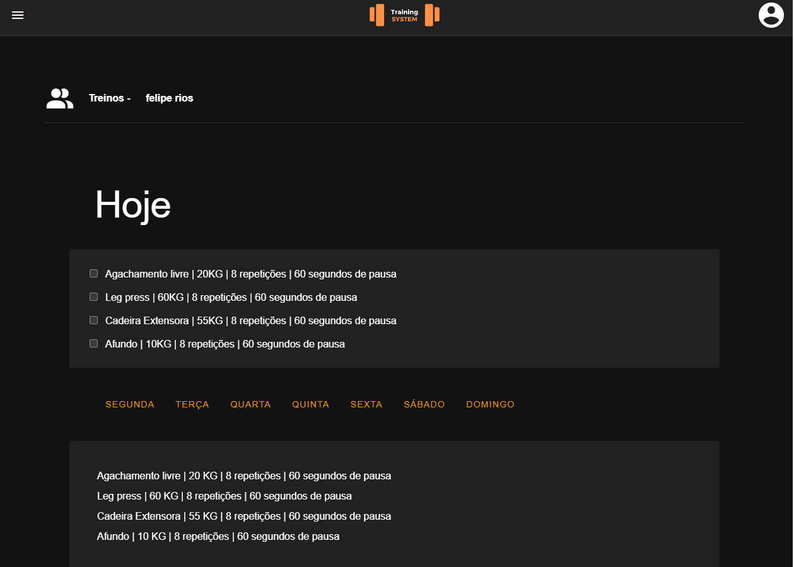

# Training System

O sistema Training System é uma solução completa para academias, permitindo que você armazene informações detalhadas dos seus alunos e crie treinamentos personalizados com facilidade.
Simplificamos a gestão de dados e treinamentos, proporcionando uma experiência eficiente e eficaz para ajudar você a alcançar os melhores resultados com seus alunos.

## Tecnologias Utilizadas

**HTML:** Linguagem de marcação utilizada para criar e estruturar documentos na World Wide Web.

**CSS:** Linguagem de estilo utilizada em conjunto com o HTML para controlar a apresentação e a aparência de páginas da web.

**JAVASCRIPT:** Linguagem de programação utilizada para criar interatividade e funcionalidades dinâmicas em páginas da web.

**VUEJS 3:** É um framework JavaScript de código aberto utilizado para a criação de interfaces de usuário interativas e dinâmicas em aplicações web.

**VUETIFY:** É uma biblioteca de componentes de interface do usuário (UI) para o framework JavaScript Vue.js.

**VUEDATEPICKER:** É um componente de datepicker para aplicações Vue.js.

**AXIOS:** É uma biblioteca JavaScript que é usada para fazer requisições HTTP a servidores a partir de uma aplicação web.

**VUE ROUTER:** É uma biblioteca de gerenciamento de rotas para aplicações Vue.js.
## Telas do Projeto
- Login
- Cadastro de Usuários
- Dashboard
- Gerenciar Exercícios
- Gerenciar Alunos
- Cadastrar Aluno
- Cadastrar Treino
- Visualizar Treino

## Funcionalidades
- Login utilizando e-mail e senha
- Logout
- Cadastro de usuários
- Validação de dados digitados
- Navegação entre as páginas
- Cadastro de exercícios
- Cadastrar alunos
- Montagem de treinos para um aluno específico
- Vizualizar exercícios programados para o dia
- Marcar quando tiver terminado um exercício específico
- Vizualizar os treinos de todos os dias da semana

## Demonstração das Telas
<h3>Login:</h3>

<h3>Cadastro de Usuários:</h3>

<h3>Dasboard:</h3>

<h3>Gerenciar Exercícios:</h3>

<h3>Gerenciar Alunos:</h3>

<h3>Cadastrar Aluno:</h3>

<h3>Cadastrar Treino:</h3>

<h3>Visualizar Treino:</h3>


## Como Executar

 1. Faça a clonagem da API:
  ```
 git clone  https://github.com/DEVinZucchetti/api_academia
```
2. Instale os pacotes da API:
```
npm install
```
3. Execute a API:
```
npm run server
```

4. Faça a clonagem do sistema:
```
git clone  https://github.com/ThiagoRiosB/projeto-training-system
```
5. Instale os pacotes do Vuejs:
```
npm install
```

6. Execute o projeto:
```
npm run dev
```


## Melhorias Futuras

- Não permitir que as páginas sejam trocadas pela URL.
- Ao cadastrar um treino, incluir um vídeo que demonstre a execução correta do exercício.
- Implementar tokens de acesso e de refresh para aumentar a segurança das informações dos usuários.

## Autor

- [@ThiagoRiosB](https://github.com/ThiagoRiosB)

[](https://www.linkedin.com/in/thiago-rios-98a52a104/)

